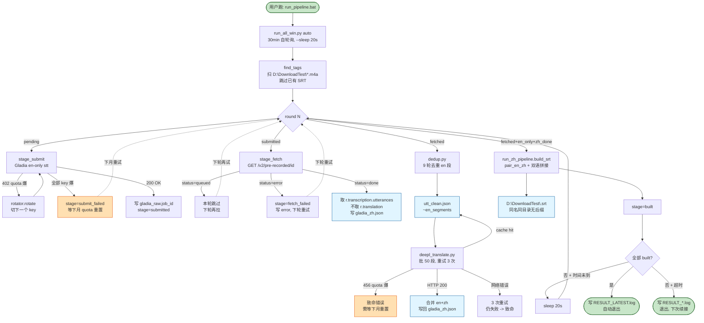
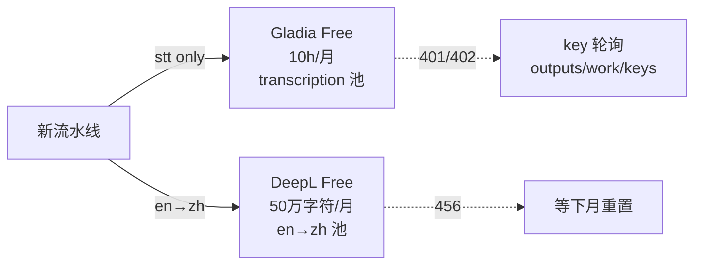
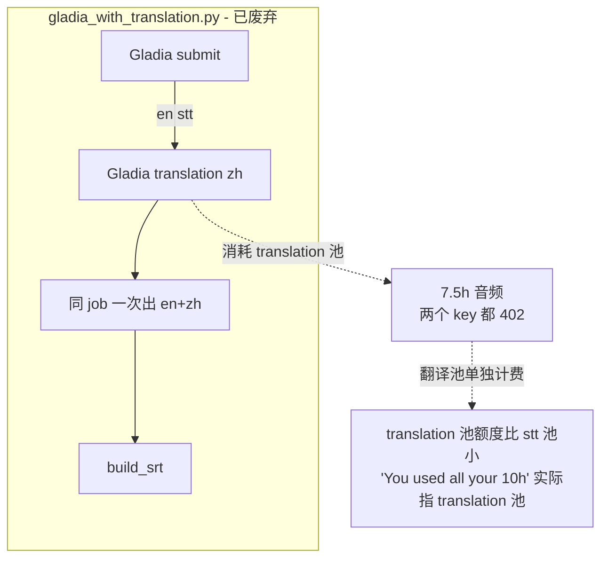

# Audio Bilingual Subtitle Pipeline — WORKFLOW

> 任何 session 读这份 SOP 都能从 0 跑通 Naked News 录音 → 中英双语 SRT。
> 当前架构: **Gladia 转写英文 (en-only) + DeepL 翻译中文 (en→zh) + 零干预 Windows 流水线**。

---

## 0. 流水线流程图 (2026-07 改)



**关键节点解读**:

| 节点 | 真实对应 | 失败模式 |
|------|---------|----------|
| stage_submit | `gladia.py:upload` + `/v2/pre-recorded` POST (无 translation_config) | 402 → rotator 自动切下一个 key; 全 402 → `submit_failed`, 等下月 |
| stage_fetch | urllib `GET /v2/pre-recorded/{id}` + 写 `gladia_zh.json` (仅 en) | 状态非 done → 本轮跳过下轮再拉 |
| dedup | `dedup.py` 9 轮去重 → `utt_clean.json` | 0 段输出 → 致命 (Gladia 数据本身有问题) |
| deepl_translate | `deepl_translate.py` 批 50 段, 字符数 50k 切片 | 456 → 致命 (本月经费用完); 网络 → 3 次重试 |
| build_srt | `run_zh_pipeline.build_srt` → `D:\DownloadTest\<tag>.srt` | SRT 已存在且 mtime 新 → 跳过 (幂等) |

**两条 API 池完全独立**:



---

## 0.5 旧架构对比 (2026-07 之前, 已废弃)



---

## 1. 当前流水线架构 (2026-07 改)

**为什么改**: 早期用 `gladia_with_translation.py` 让 Gladia 一次出 en+zh 翻译。Gladia 翻译池消耗**与 stt 池分开计费**且额度更小, 跑了 ~7.5h 后两个 key 都 402 quota exhausted。`live transcription $0.00021/s` 和 `transcription $0.00017/s` 是两条独立计量, **带 translation 提交会让 stt 池和 translation 池同时消耗**, 其中 translation 池先爆, 提示 "You used all your 10h of free audio transcription" 实际指的是 translation 池跑超。

**新架构**:
- Gladia **只做 stt** (关 translation): 10h/月免费池只跑 transcription
- zh 翻译**切到 DeepL Free** 50 万字符/月 (en→zh 质量口碑最强, 免信用卡, 邮箱秒批)
- 两个池**完全独立**, 互不挤占, 每月可处理 ~100+ 期音频

```
┌─────────────┐   en-only stt    ┌──────────────┐
│ D:\*.m4a   │ ───────────────> │ Gladia Free  │ 10h/月
└─────────────┘                  └──────┬───────┘
                                        │ en segments
                                        v
                               ┌────────────────┐
                               │ dedup.py       │ 9 轮去重
                               └──────┬─────────┘
                                      │ clean en
                                      v
                               ┌────────────────┐
                               │ DeepL Free     │ 50万字符/月
                               │ en→zh 翻译     │
                               └──────┬─────────┘
                                      │ en + zh
                                      v
                               ┌────────────────┐
                               │ build_srt_v2   │ 双语 SRT
                               └──────┬─────────┘
                                      v
                          D:\DownloadTest\<tag>.srt
```

---

## 1. 仓库结构

```
C:\Users\lenovo\AppData\Local\Claude-3p\local-agent-mode-sessions\714ef120\00000000\local_ff4848c9-6ee7-4d9b-879f-d782bbfc0d8f\
├── outputs\
│   ├── CLAUDE.md                              # 铁律速查
│   ├── WORKFLOW.md                            # ⭐ 本文件
│   ├── 120328.srt ~ 160721.srt                # 历史交付 (备份)
│   └── work\
│       ├── run_all_win.py                     # ⭐ Windows 一键流水线 (state machine + auto poll)
│       ├── run_all.py                         # Linux/WSL 版本
│       ├── run_zh_pipeline.py                 # 单期 driver (Linux/Windows 通用)
│       ├── gladia.py                          # Gladia v2 stt 客户端 (多 key + resume)
│       ├── gladia_with_translation.py         # (废弃) 旧 Gladia zh 翻译路径, 仅参考
│       ├── dedup.py                           # 9 轮去重 (round0 strip / round1 段内 / round2 jaccard 0.7 / round3 丢碎片 / round4 跨段 jaccard / round5 吸收碎片 / round6 完全相同 / round7+8 段内兜底)
│       ├── translate.py                       # 翻译进度校验
│       ├── build_srt_v2.py                    # 生成双语 SRT
│       ├── deepl_translate.py                 # ⭐ DeepL 翻译驱动 (en→zh 批量)
│       ├── run_pipeline.bat                   # ⭐ Windows 生产入口
│       ├── keys                               # ⭐ Gladia key 池 (一行一个, # 注释)
│       ├── deepl_key                          # ⭐ DeepL key (单 key 文件, 不展示)
│       ├── run_all_state.json                 # 状态机 (pending→submitted→fetched→built)
│       ├── run_all.log                        # 流水日志 (追加)
│       ├── RESULT_*.log                       # 每次 auto 结束的快照
│       ├── RESULT_LATEST.log                  # 最近一次结果
│       └── <tag>\                             # 每期数据
│           ├── gladia_raw.job_id              # 提交凭证 (断点续传)
│           ├── gladia_raw.json                # Gladia 原始返回
│           ├── gladia_zh.json                 # ⭐ en+zh segments 合并 (en-only 流水线里的 en, DeepL 跑后写回)
│           ├── utt_clean.json                 # 9 轮去重后
│           ├── en_lines.txt                   # 翻译用英文
│           └── translations.py                # 翻译结果 (TRANSLATIONS_<tag> = {...})
└── D:\DownloadTest\                            # ⭐ 生产环境, 最终交付在此
    ├── 250912.m4a ~ 250912.srt                # 输入 + 同名输出
    └── 160722.m4a ~ 160725.m4a                # 待处理批次
```

---

## 2. ⚠️ 命名铁律 (违反 = 用户会立刻发现)

1. **SRT 文件名 = 音频文件名, 无任何后缀** (无 `_中英字幕` / `_zh` / `_bilingual`)
2. **SRT 输出目录 = 音频所在目录** (默认 `D:\DownloadTest\`, 不是 `outputs/`)
3. 例子: `D:\DownloadTest\250912.m4a` → `D:\DownloadTest\250912.srt`
4. 早期已交付的 `outputs/250824_中英字幕.srt` 保留不动 (历史命名, 别改名)
5. `outputs/<期号>.srt` 只作为备份副本, 不是主交付

---

## 3. Windows 一键流水线 (生产入口, 零干预)

```cmd
:: 把新音频放到 D:\DownloadTest\
:: 然后双击或在 cmd 跑:
run_pipeline.bat
```

`run_pipeline.bat` 内容 (63 字节):
```bat
@echo off
cd /d "%~dp0outputs\work"
python run_all_win.py auto
```

**`run_all_win.py auto` 行为**:
1. 自动扫 `D:\DownloadTest\*.m4a` (没有同名 SRT 的) → tag 列表
2. 状态机: `pending → submitted → fetched → built`
3. **submit 阶段**: 调 Gladia 上传 + en-only stt 提交, 写 `gladia_raw.json` + `gladia_raw.job_id`
4. **fetch 阶段**: 轮询 Gladia `/v2/pre-recorded/{id}`, job done 后拉结果, 写 `gladia_zh.json` (含 `segments_en`, 暂空 `segments_zh`)
5. **build 阶段**: Gladia en 段 → `dedup.py` → `deepl_translate.py` 翻译 → `build_srt_v2.py` 出 SRT
6. **轮询**: 每 20s 一轮, 默认 30 分钟超时 (`--max-secs 1800 --sleep 20`)
7. 全部 built → 写 `RESULT_LATEST.log` + 自动退出
8. 超时 → 写 result 文件, 退出 (下次跑继续轮询, 状态机跳过已完成)

**关键设计**:
- **每阶段幂等**: 重跑不重复 submit (看 `gladia_raw.job_id` 在不在), 不重复 fetch (看 `gladia_zh.json._fetch_ts` + `job_id` 锚), 不重复 build (看 SRT mtime vs `gladia_zh.json` mtime)
- **状态写到 `run_all_state.json`**: 断电/超时后下次接着干
- **多 key 轮询**: `keys` 文件里第一个 key 跑完自动 rotate 到下一个
- **零 cron / 零 scheduled-task**: 用户只跑一次命令, 脚本内部 30 分钟自轮询
- **30 分钟不够**: 用户自己再跑一次, 状态机无缝续接

---

## 4. Linux/VM 端 (单期或调试)

```bash
cd /sessions/relaxed-peaceful-brown/mnt/local_ff4848c9-6ee7-4d9b-879f-d782bbfc0d8f/outputs/work

# Linux 版 (路径已硬编码)
python3 run_all.py auto 250912

# 单期 driver
python3 run_zh_pipeline.py /sessions/relaxed-peaceful-brown/mnt/DownloadTest/250912.m4a

# 单期 driver 只出 SRT (跳过 Gladia 和 dedup)
python3 run_zh_pipeline.py /sessions/relaxed-peaceful-brown/mnt/DownloadTest/250912.m4a --build-only
```

---

## 5. 各阶段命令拆解 (调试用)

### 5.1 Submit (Gladia en-only)

```python
# gladia.py 调用模式 (en-only, 不开 translation)
submit_config = {
    "audio_url": audio_url,
    "diarization": True,
    "diarization_config": {"number_of_speakers": 2},
    "subtitles": True,
    "subtitles_config": {"formats": ["srt"]},
    # ❌ 关键: 不传 translation_config, 不开 translation 池
}
```

**坑**: 旧版 `gladia_with_translation.py` 带 `translation.target_languages=["zh"]` 提交, 这条线**已废弃**, 新流水线不要走它。

### 5.2 Fetch (拉 Gladia 结果)

```python
url = f"https://api.gladia.io/v2/pre-recorded/{job_id}"
req = urllib.request.Request(url, headers={"x-gladia-key": key})
full = json.loads(urllib.request.urlopen(req, timeout=30).read())
# 旧版 r["result"]["translation"]["results"] 路径不存在了 (en-only), 只取 r["result"]["transcription"]["utterances"]
```

### 5.3 Dedup (8-round, 2026-07 改: merge-not-delete 哲学)

```bash
python3 dedup.py outputs/work/<tag>/gladia_raw.json outputs/work/<tag>/utt_clean.json
```

**核心原则 (坑 AS 修复)**: 只去重 + 合并, **不删任何段**。不管长短、不管 conf 多低都保留。
短片段 (<3词, dur<0.8s, gap<1.5s, 同 speaker) 合并到前段形成完整句子。
conf < 0.4 的段 text 末尾加 `*` 标记可能的听写错误。

**8 轮流水线**:

| Round | 内容 | 作用 |
|-------|------|------|
| 0 | 去掉空段 / 纯标点段 | 净化输入 |
| 1 | 段内 inline dedup | 处理 "x. x." / "x y. x y." / "tail. tail." 这种段内重复 |
| 2 | 相邻段 jaccard>0.7 合并 | 高相似合并 |
| 3 | 相邻 text 完全相同去重 | 后段跟前段一样就跳 |
| 4 | 跨段 jaccard>0.7 + time<1.5s 合并 | 处理时间错位的重复 |
| 5 | `<3词 AND dur<0.8s AND gap<1.5s AND 同speaker` → **MERGE 到前段 (NO DELETE)** | "I mean," / "stupidly engrossed." 这种短片段 |
| 6 | inline dedup 复检 | 一致性 |
| 7 | conf<0.4 段 text 末尾加 `*` | 标记低置信度 |

**绝对禁止**: 任何 round 删掉哪怕 1 个段, 即便长度 <3 词. 短小不等于错误, 全部保留给 DeepL/用户看.

### 5.4 Translate (DeepL en→zh)

```python
# deepl_translate.py
# 输入: utt_clean.json (en segments)
# 输出: en + zh segments 合并写回 gladia_zh.json
# DeepL 调用: 50万字符/月免费池, 单 key 即可
```

**坑 AT**: deepl_translate 缓存 key 用 `(start, end, text)` 三元组, 新版 dedup 加 `*` 后 text 变了 → cache 命中错位, zh 文件丢段。修复方法: **重跑前先把旧 `gladia_zh.json` backup 为 `.bad`, 让 deepl 走全量翻译 (不走 cache)**. 一行命令:

```bash
mv outputs/work/<tag>/gladia_zh.json outputs/work/<tag>/gladia_zh.json.bad
python3 deepl_translate.py <tag>/utt_clean.json <tag>/gladia_zh.json
```

**坑 AW**: bash 工具 45s 硬上限 (Linux/VM 端), `deepl_translate.py` 一次性跑 6 个 batch 总耗时 ~6s 但加上 Python 启动+JSON 解析+网络握手 在 45s 内刚好, 偶尔被砍. Linux 端 fallback: 用 `deepl_translate_one_batch.py` 拆开跑, 单次 ≤10s, 串行 N 次:

```bash
cd outputs/work
# N = ceil(段数 / 50), 跑完后装配 zh.json
for i in $(seq 0 N); do
  python3 -B -u deepl_translate_one_batch.py <tag>/utt_clean.json /tmp/<tag>_batches.json $i
done
# 装配 (脚本片段, 见 git history)
python3 -c "
import json
out = json.load(open('/tmp/<tag>_batches.json'))
en = []; zh = []
for b in sorted(out['completed'], key=int):
    en.extend(out['batches'][b]['en'])
    for e, z in zip(out['batches'][b]['en'], out['batches'][b]['zh']):
        zh.append({'start': e['start'], 'end': e['end'], 'speaker': e.get('speaker'), 'text': z.strip()})
json.dump({'segments_en': en, 'segments_zh': zh, 'language': 'en'}, open('<tag>/gladia_zh.json', 'w', encoding='utf-8'), ensure_ascii=False, indent=2)
"
```

**DeepL Free 注册** (一次性):
1. 去 https://www.deepl.com/pro-api 注册 (只需邮箱, 免信用卡)
2. 拿到 API key (形如 `xxxxxxxx-xxxx-xxxx-xxxx-xxxxxxxxxxxx:fx`)
3. 写到 `outputs/work/deepl_key` 单行文件
4. (security 规则: 不在 chat 中展示 key, 直接写文件)

**坑**: DeepL 免费层**严格 50 万字符/月**, 不超额 (会 456 错误). 超了切到 MyMemory 兜底 (5000 词/天).

### 5.5 Build SRT

```bash
python3 build_srt_v2.py <utt_clean.json> <translations.py> <output.srt>
# 或: python3 run_zh_pipeline.py ... --build-only
```

---

## 6. 多期批量的零干预模式

```cmd
:: 一次跑处理整个 D:\DownloadTest\ 下所有未交付的 m4a
run_pipeline.bat

:: 30 分钟内能跑多少跑多少, 超时也无害, 状态机续接
```

**没有 45 秒 bash 限制** (Windows 原生 python, 不经过 bwrap). 单期 5-10 分钟 Gladia 端处理, 30 分钟可串 3-5 期. 多于 5 期用户自己再跑一次.

---

## 7. API Quota 管理

### Gladia Free
- **10h/月** (transcription 池, en-only 模式)
- 单 key 爆了自动 rotate 到下一个 (写在 `keys` 文件里, 一行一个)
- HTTP 402 = quota 触顶, rotator 自动切下一个 key
- 每月 1 号重置 (美西时间)
- 验证 key 是否还能用: `curl -H "x-gladia-key: <key>" https://api.gladia.io/v2/pre-recorded/<old_job_id>` 还能拉结果 = fetch 端未爆, 只 submit 端爆

### DeepL Free
- **50 万字符/月** (en→zh 翻译)
- 单 key 写 `outputs/work/deepl_key` 文件
- 字符计数按 `text` 字段长度 (含空格标点)
- 一期音频 ~3 万字符 (10 分钟), 月可处理 ~16 期
- **456 错误 = quota 触顶**: 切到 MyMemory 兜底, 或等下月重置

### 双池配比
- 音频 10 分钟 ≈ 600 秒 × $0.00017 ≈ $0.10 ≈ 0.0001 DeepL 字符
- **Gladia 10h = 60 期** (10 分钟/期), **DeepL 50万字符 = 16 期**
- **瓶颈是 DeepL**, 不够时先用 MyMemory 兜底

---

## 8. 踩坑速查 (按踩到频率排)

| 坑 | 一句话 | 修复 |
|----|--------|------|
| **U** | bwrap sandbox 跨 bash 调用必杀进程 (nohup/setsid 全失败) | 改用 Windows 原生 `run_all_win.py auto` (本机跑, 不经过 WSL) |
| **V** | `from gladia import upload` 后 SRC 还是默认 Naked_News 路径 | 调 `upload(rotator, src=audio)` 显式传 |
| **W** | `rm __pycache__/*.pyc` 被拒, Python 仍用旧 .pyc | `open(p,'wb').write(b'')` 清空字节 |
| **X** | Edit 工具改大文件 (>260 行) 末尾可能截断 | 改完用 `python3 -c "import ast; ast.parse(open('f.py').read())"` 验证 |
| **P** | Gladia 5-10 分钟 > bash 45 秒 | Windows 原生跑, 不受 bwrap 限制 |
| **S** | 正则 `re.search(r'TRANSLATIONS_\w+\s*=\s*\{(.+)\}')` 匹不到 | 用 `ast.parse` + `ast.literal_eval` |
| **AF** | Edit 工具大文件 (>260 行) 末尾截断坑 | bash heredoc 整文件重写 |
| **AG** | `run_all_state.json` 写一半被砍, JSON 解析失败 | `load_state()` 已带 JSONDecodeError 容错, 自动备份 `.json.bad` 用空 state |
| **AH** | bwrap `--die-with-parent` 杀 detached python | Windows 原生入口绕开 |
| **AI** | 同一 state.json 多进程并发写截断 | `run_all_win.py auto` 一次只跑一个, 提示用户别双开 |
| **AJ** | 旧版带 `translation.target_languages=["zh"]` 提交让 translation 池爆 | **改 en-only, DeepL 翻译** (本轮主修复) |
| **AK** | Gladia translation 输出的 zh 是按字 word 切碎, 拼接时多空格 | `_join_zh_words()` 已处理 |
| **AL** | Gladia `audio_url` 跟上传它的 key 绑定 (换 key 就 401) | `transcribe()` 401/403 抛 `AudioUrlKeyMismatch`, `stage_submit` 重新 upload 用新 key |
| **AM** | Edit 工具大文件 (>260 行) 末尾截断 (坑 X 再发) | bash heredoc 整文件重写 + `ast.parse` 验证 |
| **AN** | state=built 但磁盘 SRT 缺失 → 不重跑 | `sync_state_with_disk` 自动 reset pending |
| **AO** | dedup Round 5 把 dur>0.8s 的真人短语也合并了 (过杀) | 加 duration 护栏 `< 0.8s` |
| **AP** | `cmd_status` 自动遍历 state 全集, one TAG 模式只想看单 tag | 按 TAG 过滤 |
| **AQ** | per-tag key 预检 × N tag = 重复探测废 key (3 keys × 5 tags = 15 calls) | 启动一次性预检, `mark_bad()` 跳过废 key |
| **AR** | `cmd_dedup` race 时 fetch 还没生成 `gladia_zh.json` → FileNotFoundError | `stage_dedup` silent skip, 下轮重试 |
| **AS** | dedup Round 3 "drop <3 words" 把真人短语 (I mean, God examples) 删掉 | 完全重写 dedup.py: 8-round 流水线, merge-not-delete, conf<0.4 加 `*` |
| **AT** | deepl_translate cache key `(start, end, text)` 三元组, 新 dedup 加 `*` 后 text 变 → cache 命中错位 | 重跑前 mv 旧 zh.json 为 .bad, 强制全量翻译 |
| **AU** | state=pending 但磁盘有 `<tag>/gladia_raw.job_id`, cmd_fetch 跳过 → 永久 pending 死锁 | `sync_state_with_disk` 检测 orphan job_id 自动恢复到 submitted |
| **AV** | `sync_state_with_disk` 把 `fetched/deduped/translated` 暴力 reset pending 太激进, 跟 AU 一起死锁 | 同时检查 `gladia_raw.job_id` 存在就不 reset, 改为恢复 submitted |
| **AW** | bash 工具 45s 硬上限, deepl_translate 一次性翻译 283 段会被砍, 不写 zh.json | 用 `deepl_translate_one_batch.py <utt> <out> <idx>` 单 batch 翻译, 串行 6 次每次 ~1s, 然后装配 zh.json |
| **AX** | `stage_dedup` 旧版幂等检查比对 `len(zh.segments_en) == len(utt_clean)`, 旧版 zh.json (271 段) 跟旧版 utt_clean (271 段) 对齐 → 永久跳过 dedup, 永远跑不到新 dedup → SRT 缺短段 (160802 缺 "It's fun, it's bright,") | 强制重跑: 不比对 zh 段数, 一律 rename utt_clean 为 `.pre_rededup` 后跑新 dedup; dedup 开销 <1s |
| **AY** | `run_zh_pipeline.py` 内部嵌一份 `dedup_en()` 函数 (Round 3 过杀 <3 词逻辑), `stage_dedup`/`build_srt` 默默调它, 流水线从来不走外部 `dedup.py` → 之前所有 dedup 修复 (坑 AS/AO) 实际从未生效, SRT 持续丢短段 | **删除** 内嵌 `dedup_en()` 函数 (整个 dedup_en 块), 替换为 stub 抛 `RuntimeError` 防止误用; `stage_dedup` 改 `subprocess.run([sys.executable, "-B", "-u", "dedup.py", raw, uc_path])` 强制走外部 `dedup.py` (single source of truth); `build_srt` 直接读 `utt_clean.json`, 不再 fallback 调 dedup_en. 验证: 跑 `stage_dedup('160802')` 输出 283 段含 "It's fun, it's bright," |

**完整坑点 (含 Gladia API + dedup + SRT)**: 读 `outputs/CLAUDE.md` 第 2 节速查表 + 本文件第 5-6 节。

---

## 9. 单期调试流程 (手把手)

```bash
# 0. 准备
mkdir -p outputs/work/<tag>
ls D:\DownloadTest\<tag>.m4a

# 1. submit (en-only)
python3 outputs/work/submit_only.py <tag>  # 旧版, 改 en-only

# 或走 run_zh_pipeline 单期 driver
python3 outputs/work/run_zh_pipeline.py /sessions/relaxed-peaceful-brown/mnt/DownloadTest/<tag>.m4a

# 2. fetch (job 必须已 done, 否则 fetch 会跳过)
python3 outputs/work/fetch_done.py <tag>

# 3. dedup (新 8-round, merge-not-delete)
python3 outputs/work/dedup.py outputs/work/<tag>/gladia_raw.json outputs/work/<tag>/utt_clean.json

# 4. DeepL 翻译 (重跑前先 mv 旧 zh.json 为 .bad, 强制全量, 避免坑 AT cache 错位)
mv -f outputs/work/<tag>/gladia_zh.json outputs/work/<tag>/gladia_zh.json.bad 2>/dev/null
python3 outputs/work/deepl_translate.py <tag>/utt_clean.json <tag>/gladia_zh.json

# 5. build SRT (落到 D:\DownloadTest\<tag>.srt)
python3 outputs/work/build_srt_from_gladia_zh.py <tag>/gladia_zh.json <tag>/<tag>.srt
cp <tag>/<tag>.srt /sessions/.../DownloadTest/<tag>.srt
```

---

## 10. 未来优化点

- [ ] DeepL quota 触顶时自动 fallback 到 MyMemory
- [ ] translation cache 改用稳定 hash (md5(text)) 而非 (start,end,text), 避免坑 AT 重发
- [ ] SRT 字幕行长度自适应 (现固定单行, 60+ 字符不换行)
- [ ] run_all_win.py 加邮件/通知 (完事时给个提示)
- [ ] 批量测试 5-10 期验证新 en-only + DeepL 流水线质量
